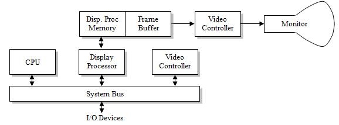
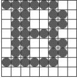
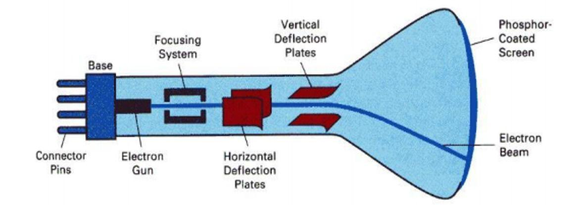
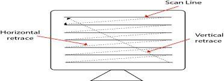

# Unit 1

##### Q1: What is computer graphics? Write down the applications of computer graphics also mention some graphic packages.
It is the creation and manipulation of  graphic images by means of a computer. Computer graphics started a technique to enhance the display information generated by a computer. This ability to interpret and represent numerical data in pictures has significantly increased the computer's ability to present information to the users in a clear and understandable form ie large bar-charts, pie-charts, and graphs.  
**Applications of computer graphics**:
  1. Computer Aided Design(*CAD*)
  2. Computer Aided Geometric Design(*CAGD*)
  3. Entertainment(animation, games etc)
  4. Computer art
  5. Presentation graphics
  6. Education and Training
  7. Geographic Information System(*GIS*)
  8. Visualization(*Scientific Visualization, Information Visualization*)
  9. Medical Visualization
  10. Image processing
  11. Graphical user interface(*GUI*)

***Graphics packages***: A set of libraries that provide programmatically access to some kind of graphic 2D function.  

**Types:**
  1. GKS(*Graphics Kernel System*): First Graphic packages accepted by ISO and  ANSI.
  2. PHIGS(*Programmers Hierarchical Interactive Graphics Standard*): Accepted  by ISO and ANSI
  3. PHIGS+ (*Expanded Package*)
  4. Silicon graphics GL(*Graphic Library*)
  5. OpenGL
  6. Pixer Render Man Interface.
  7. Postscript interpreters.
  8. Painting, drawing, design packages.

#### Architecture Of Graphics System
This component of a raster system contains display processor, display processor memory, frame buffer, video controller and I/O devices.  

  

Fig: Architecture of Graphic System  

##### Q2: What is pixel? How pixel are represented in computer memory? ***
Pixel is the smallest piece of information of an images.
- Pixels are normally arranged in a regular 2D grid, and are often represented using dots or squares.
- Each pixel is a sample of an original image where more samples typically provide a more accurate representation of the original.
- The intensity of each pixel is variable in color systems, each pixel has typically three or four components such as *Red, Green, and Blue* or *Cyan, Magenta, Yellow and Key(black)*.  

##### Q3: Define display processors. How characters can be represented using display processors?
Purposes: It frees the CPU from graphics routine task.  
The major task is to digitize a picture definition given in an application program into a set of pixel values for storage in the frame buffer. This digitization process is called scan conversion.
- Straight lines and other geometric objects are scan conversion into a set of discrete points, corresponding to screen pixel location.  
Characters can be defined with rectangular pixel grids or they can be defined with outline shapes. The array size for character grids can vary from 5x7 to 9x12 or more for higher quality displays.  
  
A character grid is displayed by super imposing the rectangular grid pattern into the frame buffer at a specified co-ordinate position.  
For characters that are defined as outlines the shapes are scanned converted into the frame buffer by locating the pixels positions closet to the outline.

##### Q4: Define frame buffer. ***

Each screen pixel corresponds to particular entry in a 2D array
residing in memory. This memory is called a frame buffer or a bit map.
The number of rows in the frame buffer equals to the number of raster
lines on the display screen.  

The number of columns in this array equals to the number of pixel on
each raster line. The term pixel is also used to describe the row and
column location in frame buffer array that corresponds to the screen
location. A 512x512 display screen requires **262144** pixel memory
locations.  

Whenever we wish to display a pixel on the screen, a specific value is
place into the corresponding memory location in the frame buffer
array.  

Each screen pixel location and corresponding memory location in the
frame buffer is accused by the non-negative integer co-ordinate
point(x,y).  

The X-value refers to the columns, the Y-values to row position.  
The origin of this co-ordinate system is positioned at the bottom left corner of the screen or it is positioned at the upper left corner of the screen.  

 

##### Q5: Define:
  - Refresh rate: It is the number of times per second the display hardware updates its information. It is similar to blinking  of eyes in human visual system. Blinking in humans is also for refreshing. There is less flickering effect for more refresh   rate in center display units. But too much refresh rate may distort  

  - Frame rate:
  - CGA(*Color Graphics Adopter*): It is a hardware video display standard. CGA uses 16 kilobytes of V-RAM. It supports 4bit  colors, that means it has 16 different colors. It supports highest resolution of 640x200.  

  - VGA(*Video Graphic Array*): It is a display hardware which supports highest resolution of 640x480. VGA supports 8bit colors   and has maximum 256 colors.  

  - Resolution: Resolution of an image refers to the total number of pixels along the entire height and weight of image.  
  *Example: A full screen image with resolution 800x600 means that there are 800 columns of pixels, each column comprising  600pixels ie a total of 800x600 is equal to 4,80,000 pixels in the image area.*   

  - Mega Pixel: A mega pixel is a unit of image sensing capacity in a digital device. Mega pixel constitutes of millions of   pixels. In general, the more mega pixel is in a device the better the resolution, when printing an image in a given size. A   digital camera with a 1.3 mega pixel resolution will print a good quality 4x3 inch print at 300dpi(dot per inch).  

  - Refreshing: In a raster scan system, the electron beam is swept across the screen one row at a time from top to bottom. As  the electron beam move across each row, the beam intensity is turned on and off to create a pattern is called refreshing.  

  - Frame: Each complete scanning of a screen is normally called a frame.  

  - Bitmap: On black and white system ie, on monochrome system the frame buffer storing the values of pixels is called a bit  map. Each entry in the bit map is the one bit data which determines the on(1) and off(0) of the intensity of the pixel.  

  - Pixmap: On color system, the frame buffer storing the values of the pixel is called a pix map. Each entry in the pix map  occupies a number of bits to represent the color of the pixels. For a true color, display the number of bits for each entry   is *24(2^3 = 8 bits per RGB channel, 2^8 = 256 level of intensity value ie, 256 voltage settings for each of the RGB  electron guns)*  

  - Aspect Ratio: The aspect ratio of a picture is the ratio of its width to its height. It is normally shown by two numbers  separated by colon as in **4:3**. Here, the primary number tells that the picture is 4 unit wide and the subsequent number  tells that the picture is 3 unit high.  

##### Q6: Explain Raster Scan System and Random Scan System.  
***Raster Scan Display***: In a raster scan system the electron beam is swept across the screen on row at a time from top to bottom. As the electron beam moves across each row, the beam intensity is turned on and off to create a pattern of illuminated spots.
Raster scan displays is based on the CRT technology.  
  
FIG: Electrostatic deflection of the electron beam  
Picture definition is stored in a memory area called the refresh buffer. This memory area holds the set of intensity values for all screen points. These stored intensity values are then retrieved from the refresh buffer and used to control the intensity of the electron beam as it moves from the spot across the screen.  
Refreshing on raster scan display is arrived out at the rate of 60 to 80 frames per second although some systems are designed for higher refresh rates. Sometimes, refresh rates are described in unit of cycles per second or Hertz(Hz). Where a cycle corresponds to one frame. At the end of each scan line, the electron beam returns to the left side of the screen to begin displaying the next scan line, the return to the left of the screen after refreshing each scan line horizontal retrace of electron beam. And at the end of each frame, the electron beam returns(vertical retrace) to the top left corner of the screen to begin the next frame.  
  

***Random Scan System***: When operated as random scan display unit, a CRT has the electron beam directed only to the parts of the screen where a picture is to be drawn. Random scan monitors draw a picture one line at a time and for this reason are also refered to as vector displays or crystallographic display.  
  

##### Q7: Difference between Raster Scan System and Random Scan System.
Difference between Raster Scan system and Random scan system is as follows:  

Serial | Raster Scan System | Random Scan System |
------ | -------------------|------------------- |
1 | The beam is moved all over the screen, one scan line at a time from top to bottom(horizontal retrace) and the back to top(vertical retrace). | The beam is moved between the end points of the graphics primitive. |
2 | Picture definition is stored as a set of intensity value of for all screen points called pixels in a refresh buffer area. | Picture definition is stored as a set of line drawing instruction in a display file. |
3 | Raster scan has ability to display areas filled with solid colors on patterns. | Random scan display draws only lines and characters. |
4 | It is less expensive. | It is more expensive. |
5 | It uses interlacing. | Interlacing is not used. |
6 | In this, resolution is less. | Resolution is high. |
7 | Uses monochrome or shadow mask type. | Uses monochrome or beam penetration type. |
8 | Raster scan display smooth lines by approximating them with pixel. | Random scan display draw a continuous and smooth lines . |
9 | Refresh rate independent of picture complexity. | Refresh rate depends directly on picture complexity. |
10 | Uses scan conversion. | Scan conversion is not required. |

##### Q8: Explain the principle of CRT Technologies.
