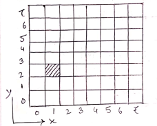
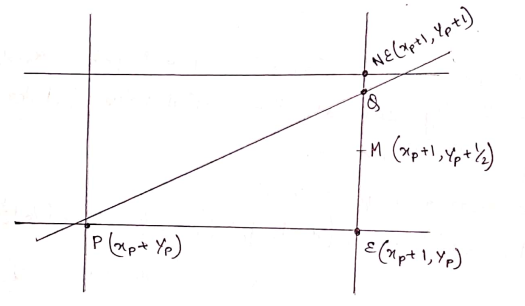
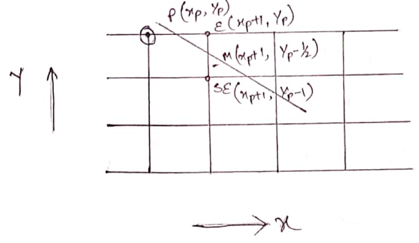

# Unit 1

##### Q1: What is computer graphics? Write down the applications of computer graphics also mention some graphic packages.
It is the creation and manipulation of  graphic images by means of a computer. Computer graphics started a technique to enhance the display information generated by a computer. This ability to interpret and represent numerical data in pictures has significantly increased the computer's ability to present information to the users in a clear and understandable form ie large bar-charts, pie-charts, and graphs.  
**Applications of computer graphics**:
  1. Computer Aided Design(*CAD*)
  2. Computer Aided Geometric Design(*CAGD*)
  3. Entertainment(animation, games etc)
  4. Computer art
  5. Presentation graphics
  6. Education and Training
  7. Geographic Information System(*GIS*)
  8. Visualization(*Scientific Visualization, Information Visualization*)
  9. Medical Visualization
  10. Image processing
  11. Graphical user interface(*GUI*)

***Graphics packages***: A set of libraries that provide programmatically access to some kind of graphic 2D function.  

**Types:**
  1. GKS(*Graphics Kernel System*): First Graphic packages accepted by ISO and  ANSI.
  2. PHIGS(*Programmers Hierarchical Interactive Graphics Standard*): Accepted  by ISO and ANSI
  3. PHIGS+ (*Expanded Package*)
  4. Silicon graphics GL(*Graphic Library*)
  5. OpenGL
  6. Pixer Render Man Interface.
  7. Postscript interpreters.
  8. Painting, drawing, design packages.

#### Architecture Of Graphics System
This component of a raster system contains display processor, display processor memory, frame buffer, video controller and I/O devices.  

  

Fig: Architecture of Graphic System  

##### Q2: What is pixel? How pixel are represented in computer memory? ***
Pixel is the smallest piece of information of an images.
- Pixels are normally arranged in a regular 2D grid, and are often represented using dots or squares.
- Each pixel is a sample of an original image where more samples typically provide a more accurate representation of the original.
- The intensity of each pixel is variable in color systems, each pixel has typically three or four components such as *Red, Green, and Blue* or *Cyan, Magenta, Yellow and Key(black)*.  


##### Q3: Define display processors. How characters can be represented using display processors?
Purposes: It frees the CPU from graphics routine task.  
The major task is to digitize a picture definition given in an application program into a set of pixel values for storage in the frame buffer. This digitization process is called scan conversion.
- Straight lines and other geometric objects are scan conversion into a set of discrete points, corresponding to screen pixel location.  
Characters can be defined with rectangular pixel grids or they can be defined with outline shapes. The array size for character grids can vary from 5x7 to 9x12 or more for higher quality displays.  
  
A character grid is displayed by super imposing the rectangular grid pattern into the frame buffer at a specified co-ordinate position.  
For characters that are defined as outlines the shapes are scanned converted into the frame buffer by locating the pixels positions closet to the outline.

##### Q4: Define frame buffer. ***

Each screen pixel corresponds to particular entry in a 2D array
residing in memory. This memory is called a frame buffer or a bit map.
The number of rows in the frame buffer equals to the number of raster
lines on the display screen.  

The number of columns in this array equals to the number of pixel on
each raster line. The term pixel is also used to describe the row and
column location in frame buffer array that corresponds to the screen
location. A 512x512 display screen requires **262144** pixel memory
locations.  

Whenever we wish to display a pixel on the screen, a specific value is
place into the corresponding memory location in the frame buffer
array.  

Each screen pixel location and corresponding memory location in the
frame buffer is accused by the non-negative integer co-ordinate
point(x,y).  

The X-value refers to the columns, the Y-values to row position.  
The origin of this co-ordinate system is positioned at the bottom left corner of the screen or it is positioned at the upper left corner of the screen.  

 

##### Q5: Define:
  - Refresh rate: It is the number of times per second the display hardware updates its information. It is similar to blinking  of eyes in human visual system. Blinking in humans is also for refreshing. There is less flickering effect for more refresh   rate in center display units. But too much refresh rate may distort  

  - Frame rate:
  - CGA(*Color Graphics Adopter*): It is a hardware video display standard. CGA uses 16 kilobytes of V-RAM. It supports 4bit  colors, that means it has 16 different colors. It supports highest resolution of 640x200.  

  - VGA(*Video Graphic Array*): It is a display hardware which supports highest resolution of 640x480. VGA supports 8bit colors   and has maximum 256 colors.  

  - Resolution: Resolution of an image refers to the total number of pixels along the entire height and weight of image.  
  *Example: A full screen image with resolution 800x600 means that there are 800 columns of pixels, each column comprising  600pixels ie a total of 800x600 is equal to 4,80,000 pixels in the image area.*   

  - Mega Pixel: A mega pixel is a unit of image sensing capacity in a digital device. Mega pixel constitutes of millions of   pixels. In general, the more mega pixel is in a device the better the resolution, when printing an image in a given size. A   digital camera with a 1.3 mega pixel resolution will print a good quality 4x3 inch print at 300dpi(dot per inch).  

  - Refreshing: In a raster scan system, the electron beam is swept across the screen one row at a time from top to bottom. As  the electron beam move across each row, the beam intensity is turned on and off to create a pattern is called refreshing.  

  - Frame: Each complete scanning of a screen is normally called a frame.  

  - Bitmap: On black and white system ie, on monochrome system the frame buffer storing the values of pixels is called a bit  map. Each entry in the bit map is the one bit data which determines the on(1) and off(0) of the intensity of the pixel.  

  - Pixmap: On color system, the frame buffer storing the values of the pixel is called a pix map. Each entry in the pix map  occupies a number of bits to represent the color of the pixels. For a true color, display the number of bits for each entry   is *24(2^3 = 8 bits per RGB channel, 2^8 = 256 level of intensity value ie, 256 voltage settings for each of the RGB  electron guns)*  

  - Aspect Ratio: The aspect ratio of a picture is the ratio of its width to its height. It is normally shown by two numbers  separated by colon as in **4:3**. Here, the primary number tells that the picture is 4 unit wide and the subsequent number  tells that the picture is 3 unit high.  


##### Q6: Explain Raster Scan System and Random Scan System.  
***Raster Scan Display***: In a raster scan system the electron beam is swept across the screen on row at a time from top to bottom. As the electron beam moves across each row, the beam intensity is turned on and off to create a pattern of illuminated spots.
Raster scan displays is based on the CRT technology.  
  
FIG: Electrostatic deflection of the electron beam  
Picture definition is stored in a memory area called the refresh buffer. This memory area holds the set of intensity values for all screen points. These stored intensity values are then retrieved from the refresh buffer and used to control the intensity of the electron beam as it moves from the spot across the screen.  
Refreshing on raster scan display is arrived out at the rate of 60 to 80 frames per second although some systems are designed for higher refresh rates. Sometimes, refresh rates are described in unit of cycles per second or Hertz(Hz). Where a cycle corresponds to one frame. At the end of each scan line, the electron beam returns to the left side of the screen to begin displaying the next scan line, the return to the left of the screen after refreshing each scan line horizontal retrace of electron beam. And at the end of each frame, the electron beam returns(vertical retrace) to the top left corner of the screen to begin the next frame.  
  

***Random Scan System***: When operated as random scan display unit, a CRT has the electron beam directed only to the parts of the screen where a picture is to be drawn. Random scan monitors draw a picture one line at a time and for this reason are also referred to as vector displays or crystallographic display.  
  

##### Q7: Difference between Raster Scan System and Random Scan System.
Difference between Raster Scan system and Random scan system is as follows:  

Serial | Raster Scan System | Random Scan System |
------ | -------------------|------------------- |
1 | The beam is moved all over the screen, one scan line at a time from top to bottom(horizontal retrace) and the back to top(vertical retrace). | The beam is moved between the end points of the graphics primitive. |
2 | Picture definition is stored as a set of intensity value of for all screen points called pixels in a refresh buffer area. | Picture definition is stored as a set of line drawing instruction in a display file. |
3 | Raster scan has ability to display areas filled with solid colors on patterns. | Random scan display draws only lines and characters. |
4 | It is less expensive. | It is more expensive. |
5 | It uses interlacing. | Interlacing is not used. |
6 | In this, resolution is less. | Resolution is high. |
7 | Uses monochrome or shadow mask type. | Uses monochrome or beam penetration type. |
8 | Raster scan display smooth lines by approximating them with pixel. | Random scan display draw a continuous and smooth lines . |
9 | Refresh rate independent of picture complexity. | Refresh rate depends directly on picture complexity. |
10 | Uses scan conversion. | Scan conversion is not required. |

##### Q8: Explain the principle of CRT Technologies.
A Cathode Ray Tube(CRT) is a specialized vacuum tube in which image are produced when an electron beam stickers a [phosphorescent](https://en.wikipedia.org/wiki/Phosphorescence) screen. Most desktop computer displays make sure of CRTs. The CRT in a computer display is similar to the picture tube in a television receiver. A cathode ray tube consists of several basic components as illustrated below. The electron gun generates a narrow beam of electrons. The anodes accelerate the electrons. Deflecting coils produce an extremely low frequency electro magnetic field that allows for constant adjustment of the direction of the electron beam. There are two sets of deflecting coils: horizontal and vertical. The intensity of the beam can be varied. The electron beam produces a tiny, bright visible spot when it strikes the phosphor coated screen.  
  

To produce an image on the screen, complex signals are applied to the deflecting coils and also to the apparatus that controls the intensity of the electron beam. This causes the spot to race across the screen from right to left and from top to bottom, in a sequence of horizontal lines called raster as viewed from the front of the CRT, the spot moves in a pattern similar to the way that eyes move when reading a single column page of text but the scanning takes place as such a rapid that our eyes sees a constant image over the entire screen.  
The illustration show only one electro-gun.

##### Q9: Consider a raster system with a resolution of 640x480. Find the size of the frame buffer in bytes to store it if 12bits/pixel are fixed.  
Given, resolution = 640 * 480  
1 pixel can store = 12 bits  
then the size of the frame buffer in memory(in Megabytes):  
  

  

 which is required  

##### Q10: How much time is spent in scanning across each row of pixels during screen refresh on a raster system with a resolution of 1280x1024 and refresh rate of 60FPS/Hz.  
Here, resolution   
It means that 1024 scan lines takes  sec.  
 *1 scan line takes =*  *seconds.*

##### Q11: If the screen resolution is 600x400 and the frames/second is 30, find out the time required to transfer 1 pixel.
Here, resolution =   
that means system contains 400 scan lines and each scan line contains 600 pixels.  
refresh rate   

1 frame takes   

 *resolution* = *, 1 frame buffer consists of 400 scan lines.*  

It means that 400 scan lines takes   

1 scan line takes 

##### Q12: What is the aspect ratio of 12inch x 16inch display.
Factors of 12 and 16 are  
  
  
common denomenator is 4  
Now we have to find the aspect ratio ie :  
*x = CRT weidth/common denomenator =*   
*y = CRT height/common denomenator =*   
 Aspect ratio is   

### Interactive Input/Output Device
###### Input/Output device used for computer graphics:
***Input Devices:*** Various hardware devices have been develop to enable the user to interact in the more natural manner. These devices can be separated into two classes. They are:  
1. **Locators**: Locators are the devices which give position information. The computer reveives from a locator, the co-ordinates for a point. Using a locator we can indicate a position on the screeen. The different locators are as follows:
	* *Joysticks*: A joystick has two potentiometers. They have been attached to a single lever. Moving the lever forward and backwards changes the settings on one potentiometer.
	* *Mouse*: An input device that enables us to edit and manipulate.  For example: *in terms of computer graphics, the mouse can be used to crop and image or to use the magic wand tool etc.*
	* *Tablet*: A tablet composed of a flat surface and a pen like stylus or window like tablet cursor. The tablet is able to sense the position of the stylus.
2. **Selector**: Selector devices are used to detect the particular graphical object. A selector may pick a particular item but provide no information about that item is located on the screen. The different selector devices are as follows:
	* *Light Pen*: A input device that allows us to draw on a screen with greater positional accuracy, similarly to how we would on a graphic tablet. It can also be used to point it displayed object.
	* *Keyboard*: The keyboard is an efficient device for inputing such non-graphic data. Cursor control keys and function keys are common features on general purpose keyboards. Additional numeric keyboard is often included on the keyboard for fast entry of numeric data.
	* *Trackball and Space-ball*: The space-ball and trackball are used to accurately draw on the computer. Trackballs and space balls are mainly seen or used for arcade games.
	* *Data glove*: A data glove is a glove which has been wired up with wax which sense movements. These sensors are connected to the computer which then sense the movement of the hand to get information across.
	* *Digitizers*: An input device that allows us to hand draw graphics an images or a flat screen using a stylus where we can also do painting, selecting, dragging and move.
	* *Scanners*: An input device that allows us to scan an image, poster, photograph etc which can then be uploaded and edited in a graphic software package.
	* *Touch Panels*: Touch panels allow displayed object or screen positions to be selected with the touch of a finger. Touch input can be recorded using three methods, namely optical touch panels, electrical touch panels and acoustical touch panels.
	* *Voice Systems*: Speech recognition is used in some graphic workstations as input devices to accept voice command. The voice system can be used to initiate graphics operations or to enter data.

#### Output Devices:
* *Printers*: This allow us to print of the graphics with create and edit on the computer. We can print them off in color, black and white or gray scale in various sizes.
* *Plotters*: Plotter is another type of computer printer which prints vector graphics. There are two types of plotters: One is a pen plotter which is when a pen moves across the surface of the paper and then there is a knife plotter which uses moving knives to cut into a piece material.
* *Monitors*: This allows us to see the images produced by the computer. The quality of the graphics that we sea depends on the size and the resolution of the monitors.
* *Phosphors*: The phosphors used in a graphic display are normally chosen for their color characteristics and persistence color should preferably white particularly for applicants where dark information appears on a light background.
* *Electron guns*: Electron gun makes use of electro static fields to focus and accelerate the electron beam. A field is generated when two surfaces are raised to different potentials.

## Bresenhams's line drawing algorithm:
Let us consider the line in the fig where P is the previously selected pixels and E and NE are two pixels from which we choose at the next stage. Let Q be the intersection point of the line being scan converted with the grid line 
  
The difference between vertical distances from E and NE to Q is computed and the sign of the difference is used to select the pixel whose distance from Q is smaller as the best approximation to the line. If the mid point M lies above the line, the pixel E is chosen to the line; if the mid point lies below the line pixel NE is chosen to the line.  
Let us consider the straight line by the equation  
  

The equation straight line can be written as  
  

  

or   
or   

Comparing 1 and 2, we get  
  

 *for points on the straight line*  
 *for points below the straight line*  
 *for points above the straight line*  
We now consider the decision variable.  
, [where  is the co-ordinates of the mid point M]  
  

If d>0, we choose the pixel NE  
If d<0, we choose the pixel E  
If d=0, we choose either of the pixels, so we pick E.  
If E is chosen, M is incremented by 1 step in x direction and we get  
  
  

  
If NE is chosen then M is incremented in both x and y directions by 1 unit. In this:  

  
  
  

  
  
Since the first pixel is simply the first end point , we can directly calculate the initial value of d for choosing between E and NE.
The first mid point is at  
  
  
  
  

Thus,   
Using , we can choose the 2nd pixel and so on.  
To eliminate the fraction in , we define the original equation  by multiplying it by 2, ie,   
This multiplies each constant and the decision variable by 2, but does not effect the sign of the decision variable.


##### Q13: Write an algorithm to draw a straight line between the points and  using Bresenham's line drawing or mid point algorithm.  

<!-- Algorithm -->
```c
Bresenhams line(x0, y0, x1, y1, color)
int x0, y0, x1, y1, color
/* We want to draw a straight line from (x0+y) to (x1+y1) color gives the pixels color */
{
  int dx, dy, incrE, incrNE, d, x, y;
  dx = x1 - x0;
  dy = y1 - y0;
  d = 2 * dy - dx;
  incrE = 2 * dy;
  incrNE = 2 * (dy - dx);
  x = x0;
  y = y0;
  put pixel(x, y, color);
  while(x < x1)
  {
    if(d <= 0)
    {
      d = d + incrE;
      x = x + 1;
    }
    else
    {
      d = d + incrNE;
      x = x + 1;
      y = y + 1;
    }
    put pixel(x, y, color);
  }
}
```
## Bresenham's Circle drawing algorithm:
Assuming the center of the circle is at the origin. In the below figure for a point.  
  
(h,k), we can draw a total of 8 points on the circle. Hence, we need to draw a curve from A to B, where .  

Let the equation of the circle be  
 where R is the radius of the circle.  
Let us now consider the following fig
  
Hence  is a previously selected pixel. We want to draw the next pixel which is either E or SE. The co-ordinate of the mid point is   
We now chose the decision variable:  
  
  
If d > 0, we choose the pixel SE  
If d < 0, we choose the pixel E  
If d = 0, we choose either of the pixels and so, we pick E  
when E is chosen,  
  
  
  
where SE is chosen  
  
