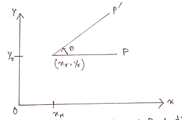
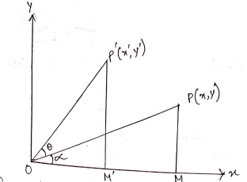

# Unit 2

### Two Dimensional Viewing

#### 2D Transformation

##### Basic Transformation:

 With the procedures for displaying output primitive and their attributes, we can create a variety of pictures and graphics. In many application, there is also a need for altering or manipulating displays. Design application and facility layouts are created by arranging the orientations and sizes of the component parts of the scene and orientations are produced by moving the camera or the objects in a scene along animation path changes in orientations size and shape are accomplished with geometric transformations that alter the coordinate description of objects.  
There are three types of transformations:  
1. **Translation**: A translation is applied to an object by repositioning it along a straight line path from one coordinate locations to another.  
   
The equation of translation is given by,  
  
Where p'(x',y') is the new co-ordinate for the points p(x,y) by applying addition to x and y co-ordinates with h and k quality. In matrix form (1) can be written as:  
  
or  
 where  is the translation matrix.  

2.  **Scaling**: A scaling transformation alters the size of an object. This operation can be carried for polygons by multiplying the co-ordinates value(x,y) of each vertex by scaling factors by  to produce the transformed co-ordinates.  
      
    Points can be scaled (or stretched) by  along x and y axis respectively, then the new co-ordinates can be obtained as  
      
    In matrix form equation (2) can be written as  
      
    or  
     where  is the sealing matrix.  

3.  **Rotation**: A two dimensional rotation is applied to an object by repositioning it along a circular path in the XY plane. To generate a rotation we specify. a rotation angle (-) and the position  of the rotation point about which the object is to be rotated.  
       
    Points can be rotated through an angle D about the origin R is described by:  
    
      
    Fig: Rotation of an object through angle D about the rotation point   
    The equation (3) can be written as:  
      
    or   
    Note:  
      
    From the triangle OPM, we see that  
    ![formula](https://latex.codecogs.com/svg.latex?%5Cinline%20%5Clarge%20sin%5Calpha%3D%5Cfrac%20%7By%7D%7Br%7D%5C%5C%20%7B%5Ccolor%7BRed%7D%20or%7D%5C%3B%20r%5C%2Csin%5Calpha%20%3D%20y%5C%5C%20%5CRightarrow%20y%3Dr%5C%2C%20sin%5Calpha%20%5C%5C%20cos%5Calpha%3D%5Cfrac%20%7Bx%7D%7Br%7D%5C%5C%20%7B%5Ccolor%7BRed%7D%20or%7D%5C%3B%20r%5C%2C%20cos%5Calpha%20%3D%20x%20%5C%5C%20%5CRightarrow%20x%20%3Dr%5C%2C%20cos%5Calpha%5C%5C%5C%5C%20From%5C%3B%20%5Cbigtriangleup%20OP%27M%27%5C%3B%20we%5C%3B%20see%5C%3B%20that%5C%5C%20sin%28%5CTheta+%5Calpha%29%3D%5Cfrac%20%7By%27%7D%7Br%7D%5C%5C%20%5CRightarrow%20y%27%3Dr%5C%2C%20sin%28%5CTheta+%5Calpha%29%5C%5C%5C%5C%20%7B%5Ccolor%7BRed%7D%20Similarly%7D%2C%5C%5C%20cos%28%5CTheta+%5Calpha%29%3D%5Cfrac%20%7Bx%27%7D%7Br%7D%5C%5C%20%5CRightarrow%20x%27%3Dr%5C%2C%20cos%28%5CTheta+%5Calpha%29%5C%5C%5C%5C%20%7B%5Ccolor%7BRed%7D%20Now%7D%2C%5C%5C%20x%27%3Dr%5C%3Bcos%28%5CTheta+%5Calpha%29%5C%5C%20%3Dr%28cos%5CTheta*cos%5Calpha-sin%5CTheta*sin%5Calpha%29%5C%5C%20%5Cbegin%7Bmatrix%7D%20%3Dr%5C%2Ccos%5Calpha*cos%5CTheta-r%5C%2Csin%5Calpha*sin%5CTheta%20%26%20%5C%3B%5C%3B%5C%3B%5C%3B%5C%3B%5C%3B%5C%3B%5C%3B%5C%3B%5C%3B%5BS_y*x%3Dr%5C%2Ccos%5Calpha%5D%20%5C%5C%20%3Dx*cos%5CTheta-y*sin%5CTheta%20%26%20%5C%3B%5C%3B%5C%3B%5C%3B%5C%3B%5C%3B%5C%3B%5C%3B%5C%3B%5C%3B%5BS_x*y%3Dr%5C%2Csin%5Calpha%5D%20%5Cend%7Bmatrix%7D%5C%5C%20y%27%3Dr%5C%2Csin%28%5CTheta+%5Calpha%29%5C%5C%20%3Dr%28sin%5CTheta*cos%5Calpha+cos%5CTheta*sin%5Calpha%29%5C%5C%20%3Dr%5C%3Bsin%5CTheta*cos%5Calpha+r%5C%3Bcos%5CTheta*sin%5Calpha%5C%5C%20%3Dr%5C%3Bsin%5CTheta+y%5C%3Bcos%5CTheta)  <!-- sin\alpha=\frac {y}{r}\\
    {\color{Red} or}\; r\,sin\alpha = y\\
    \Rightarrow y=r\, sin\alpha \\
    cos\alpha=\frac {x}{r}\\
    {\color{Red} or}\; r\, cos\alpha = x \\
    \Rightarrow x =r\, cos\alpha\\\\
    From\; \bigtriangleup  OP'M'\; we\; see\; that\\
    sin(\Theta+\alpha)=\frac {y'}{r}\\
    \Rightarrow y'=r\, sin(\Theta+\alpha)\\\\
    {\color{Red} Similarly},\\
    cos(\Theta+\alpha)=\frac {x'}{r}\\
    \Rightarrow x'=r\, cos(\Theta+\alpha)\\\\
    {\color{Red} Now},\\
    x'=r\;cos(\Theta+\alpha)\\
    =r(cos\Theta*cos\alpha-sin\Theta*sin\alpha)\\
    \begin{matrix}
    =r\,cos\alpha*cos\Theta-r\,sin\alpha*sin\Theta & \;\;\;\;\;\;\;\;\;\;[S_y*x=r\,cos\alpha] \\
    =x*cos\Theta-y*sin\Theta & \;\;\;\;\;\;\;\;\;\;[S_x*y=r\,sin\alpha]
    \end{matrix}\\
    y'=r\,sin(\Theta+\alpha)\\
    =r(sin\Theta*cos\alpha+cos\Theta*sin\alpha)\\
    =r\;sin\Theta*cos\alpha+r\;cos\Theta*sin\alpha\\
    =r\;sin\Theta+y\;cos\Theta -->  
    Note:
    The matrix represented for scaling, translation and rotation are respectively.  
      
    where translation is in the form of addition but scaling and rotation is in the form of multiplication. We would like to be able to treat all these transformation in a consistent way as multiplication.  

##### <u>Homogeneous co-ordinate</u>

In homogeneous co-ordinate we add a third co-ordinate to a point(x,y) each point. Instead of being represented by tripple (x,y,w). At the same time we see that two sets of co-ordinates (x,y,w) and (x',y',w') represent the same point if and only if one is multiple of other.  
Also, atleast one of the homogeneous co-ordinate must be non-zero(0,0,0) is not allowed. If w != 0, we can divide the point (x,y,w) by w and we get(x/w,y/w,1). But (x,y,w) and (x/w,y/w,1) represent the same point. The points with w = 0 are called points of infinity.  

###### Translation in homogeneous co-ordinate

The equation of translation (1) can be written as:  
  
Here,  
h = dx = displacement along x-axis.  
k = dy = displacement along y-axis.  
or,  
P' = T(dx, dy)P..........................(I')  
  

###### Scaling in Homogeneous co-ordinate:
In homogeneous co-ordinate, the two dimensional scaling matrix will be  
  

###### Rotation in Homogeneous co-ordinate:
The equation of rotation can be written as:  
  
