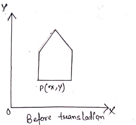
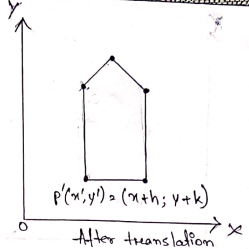
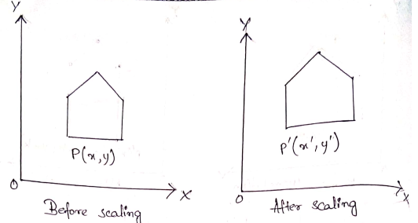
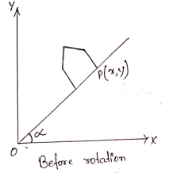
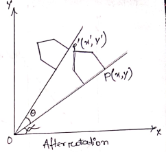

# Unit 2
### Two Dimensional Viewing
#### 2D Transformation
##### Basic Transformation:
 With the procedures for displaying output primitive and their attributes, we can create a variety of pictures and graphics. In many application, there is also a need for altering or manipulating displays. Design application and facility layouts are created by arranging the orientations and sizes of the component parts of the scene and orientations are produced by moving the camera or the objects in a scene along animation path changes in orientations size and shape are accomplished with geometric transformations that alter the coordinate description of objects.  
There are three types of transformations:  
1. **Translation**: A translation is applied to an object by repositioning it along a straight line path from one coordinate locations to another.  
   
The equation of translation is given by,  
  
Where p'(x',y') is the new co-ordinate for the points p(x,y) by applying addition to x and y co-ordinates with h and k quality. In matrix form (1) can be written as:  
  
or  
 where  is the translation matrix.  

2. **Scaling**: A scaling transformation alters the size of an object. This operation can be carried for polygons by multiplying the co-ordinates value(x,y) of each vertex by scaling factors by  to produce the transformed co-ordinates.  
  
Points can be scaled (or stretched) by  along x and y axis respectively, then the new co-ordinates can be obtained as  
  
In matrix form equation (2) can be written as  
  
or  
 where  is the sealing matrix.  

3. **Rotation**: A two dimensional rotation is applied to an object by repositioning it along a circular path in the XY plane. To generate a rotation we specify. a rotation angle (-) and the position  of the rotation point about which the object is to be rotated.  
   
Points can be rotated through an angle D about the origin R is described by:  

