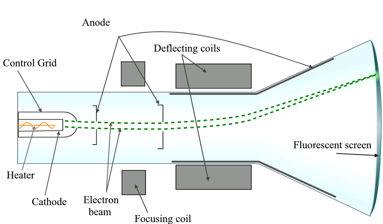

# Important Notes

### Raster Scan Disply
In a raster scan system the electron beam is swept across the screen on row at a time from top to bottom. As the electron beam moves across each row, the beam intensity is turned on and off to create a pattern of illuminated spots. Raster scan displays is based on the CRT technology.  

### Random Scan Display
When operated as random scan display unit, a CRT has the electron beam directed only to the parts of the screen where a picture is to be drawn. Random scan monitors draw a picture one line at a time and for this reason are also referred to as vector displays or crystallographic display.  

### CRT
A Cathode Ray Tube(CRT) is a specialized vacuum tube in which image are produced when an electron beam stickers a phosphorescent screen. Most desktop computer displays make sure of CRTs. The CRT in a computer display is similar to the picture tube in a television receiver. A cathode ray tube consists of several basic components as illustrated below. The electron gun generates a narrow beam of electrons. The anodes accelerate the electrons. Deflecting coils produce an extremely low frequency electro magnetic field that allows for constant adjustment of the direction of the electron beam. There are two sets of deflecting coils: horizontal and vertical. The intensity of the beam can be varied. The electron beam produces a tiny, bright visible spot when it strikes the phosphor coated screen.  
  
To produce an image on the screen, complex signals are applied to the deflecting coils and also to the apparatus that controls the intensity of the electron beam. This causes the spot to race across the screen from right to left and from top to bottom, in a sequence of horizontal lines called raster as viewed from the front of the CRT, the spot moves in a pattern similar to the way that eyes move when reading a single column page of text but the scanning takes place as such a rapid that our eyes sees a constant image over the entire screen.  
The illustration show only one electro-gun.  

### Resolution
Refers to the total number of pixels along the entire height and weight of image.  
*Example: A full screen image with resolution 800x600 mean that there are 800 columns of pixels, each column comprising 600pixels ie a total of 800x600 is equal to 4,80,000 pixels in the image area.*  

### Aspect Ratio
- Ratio of its width to its height.  
- Normally shown by two numbers separated by colon as in 4:3. 
  *The primary number tells that the picture is 4 unit wide and the subsequent number tell that the picture is 3 unit high.*  

### VGA and CGA
***VGA(Video Graphic Array)***:  
- It is a display hardware which supports highest resolution of 640x480.  
- VGA supports 8bit colors and has maximum 256 colors.  
***CGA(Color Graphics Adopter)***:  
- It is a hardware video display standard. CGA uses 16 kilobytes of V-RAM.  
- It supports 4bit colors, that means it has 16 different colors.  
- It supports highest resolution of 640x200.  

