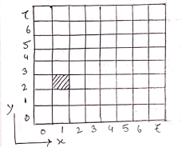
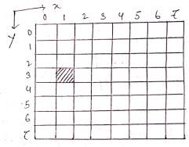
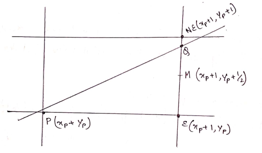

# Important questions and answers

## Unit 1

### Frame Buffer
Each screen pixel corresponds to a perticular entry in a 2d array residing memory. This memory is called a frame buffer or a bit map. The number of rows in the frame buffer equals to the number of raster lines on the display screen.  

The number of columns in this array euals to the number of pixels on each raster line. The term pixel is also used to describe the row and column location in frame buffer array that corresponds to screen location. A pixel memory locations.  

Whenever we wish to display a pixel on the screen, a specific value is placed into the corresponding memory location in the frame buffer array.  

Each screen pixel location and corresponding memory location in the frame buffer is accused bu the non-negative integer co-ordinate(x,y).  

The x-value refers to the columns, y-value refers to row position.  
The origin of this coordinate system is positioned at the bottom left corner of the screen or it is positioned at the upper left corner of the screen.  

 

### Aspect ratio

### Pixel
A pixel is the smallest piece of information of an image.
- Pixels are normally arranged in a regular 2D grid, and are often represented using dots or squares.
- Each pixel is a sample of an original image where more samples typically provide a more accurate representation of the original 
- The intensity of each pixel is variable in color system, each pixel usually has 3 or 4 components "RED, GREEN and BLUE" or "CYAN, MAGENTA and YELLOW"

### VGA

### Resolution

### Random scan

### Raster scan

### difference between random and raster scan

### CRT

### Brassenhams line drawing algorithm
Let us consider the line in the fig where P is the previously selected pixels and E and NE are two pixels from which we choose at the next stage. Let Q be the intersection point of the line being scan converted with the grid line 
  
The difference between vertical distances from E and NE to Q is computed and the sign of the difference is used to select the pixel whose distance from Q is smaller as the best approximation to the line. If the mid point M lies above the line, the pixel E is chosen to the line; if the mid point lies below the line pixel NE is chosen to the line.  
Let us consider the straight line by the equation  
  

The equation straight line can be written as  
  

  

or   
or   

Comparing 1 and 2, we get  
  

 *for points on the straight line*  
 *for points below the straight line*  
 *for points above the straight line*  
We now consider the decision variable.  
, [where  is the co-ordinates of the mid point M]  
  

If d>0, we choose the pixel NE  
If d<0, we choose the pixel E  
If d=0, we choose either of the pixels, so we pick E.  
If E is chosen, M is incremented by 1 step in x direction and we get  
  
  

  
If NE is chosen then M is incremented in both x and y directions by 1 unit. In this:  

  
  
  

  
  
Since the first pixel is simply the first end point , we can directly calculate the initial value of d for choosing between E and NE.
The first mid point is at  
  
  
  
  

Thus,   
Using , we can choose the 2nd pixel and so on.  
To eliminate the fraction in , we define the original equation  by multiplying it by 2, ie,   
This multiplies each constant and the decision variable by 2, but does not effect the sign of the decision variable.

### DDA line drawing algorithm

### Brassenhams Circle drawing algo

### Polygon filling algorithm

### Boundary filling algorithm

## Unit 2

### 2d transformation

### homogeneous coordinate

### graphic premitive

### window port & view port

### clipping and sheilding

### 3d display system

## Unit 3

### Spline

### Bspline

### Qubick spline
