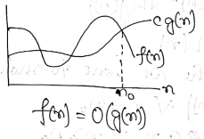

### What is an Algorithm?

An algorithm is a finite set of instructions that if followed, accomplishes a particular task. All algorithm must satisfy the following criteria:

-   Input
-   Output
-   Definiteness
-   Definiteness
-   Effectiveness  

### Algorithm to find and return the maximum of n given numbers.

    MAXIMUM

    Step1: Set Max = 0

    Step2: while (i != n)
             if(i > MAX)
               Set Max = A[i];
             else
               return;

    Step3: Print(Max)

    Step4: Exit

### Analysis of Algorithm

A complete analysis of an algorithm involves the following steps:  

1.  Implement the algorithm correctly.
2.  Determine the time required for each basic operations.
3.  Identify unknown quantities that can be used to describe the frequency of execution of basic operation.
4.  Develop a realistic model for the input to the program.
5.  Analyze the unknown quantities assuming the model input.
6.  Calculate the total running time by multiplying the time by the frequency for each operation and then adding all the products.

### Why analysis of algorithm is important.

1.  To predict the behavior of algorithm without implementing it on a specific machine.
2.  It is impossible to predict the exact behavior of an algorithm as their are too many influencing factors. The analysis is thus only an approximation, not perfect.
3.  By analyzing different algorithm, we can compare them to determine the best one for our purpose.

### Asymptotic Analysis

It is a technique of representing limited behavior. It can be used to analyze the performance of an algorithm for some large dataset.  
  
In the above function, the term  becomes insignificant compared to  when  is very large.  

### Why is Asymptotic Notation important?

1.  They give simple characteristics of an algorithm's efficiency.  
2.  It allows the comparison of the performance of various algorithm.

### Asymptotic Notation
Asymptotic notation are used to describe the running time of an algorithm.  
There are 3 notations used for describing the running time of the algorithm.
1. Big-oh Notation(O-notation): When we have an asymptotic upper-bound, we use O-notation. The O-notation is used when the function f(n) is defined as:  
  
Such that  


Graphically, we represent O notation as follows:  
  

2. Omega Notation (Ω-notation): The Ω notation is used when the function g(n) defines a lower-bound for the function f(n) which is defined as  
  
Such that  

Graphically we can represent  Ω-notation as  
  

3. Theta Notation (Θ-notation): The Θ-notation is used when the function f(n) is bounded both above and below by the function g(n), which is defined as  
  
Such that  

Graphically we can represent  Θ-notation as  
  

### Stack Algorithm
#### Using Linear Array
##### PUSH
PUSH(STACK, TOP, MAXSTK, ITEM)
This procedure pushes an ITEM onto the STACK
1. [Stack already filled?]  
If TOP = MAXSTK,  
then  
Print "OVERFLOW"  
and Exit.  
2. Set TOP = TOP+1  [Increases TOP by 1]
3. Set STACK[TOP] = ITEM. [Inserts ITEM in new TOP position.]
4. Exit.

##### POP
POP(STACK, TOP, ITEM)  
This procedure deletes the top element of STACK and assigns it to the variable ITEM.  
1. [STACK has an item to be removed?]  
If TOP = 0,  
then  
Print "UNDERFLOW"  
and Exit.
2. Set ITEM = STACK[TOP]. [Assigns TOP element to ITEM.]
3. Set TOP = TOP - 1. [Decrease TOP by 1.]
4. Exit

### Queue Algorithm


### Tree
A tree is a finite set of 1 or more node such that specially designated node for the root and the remaining nodes are partitioned into  disjoint sets T1, ....., Tn are called the subtree of the root.


#### Terminalogy:

1. Root: The root node is the topmost node in the tree hierarchy. In the above structure node 1 is the root node of the tree and would be called a parent-child relationship.  

2. Child node: If the node is the descendant of any node then the node is known as a child node.  

3. Parent node: If a node contains any sub-node then the node is called a parent node.

4. Sibling node: The node that have a same parent are known as sibling node.

5. Ancestor node: An ancestor of a node is an predecessor node on any path from root of that node. 1, 2, and 5 are the ancestors of 10.

6. Descendant: The immediate successor of the given node is known as descendant of a node. 10 is the descendant of node 5.

7. Leaf: In a tree data structure, the node which does not have a child is called as LEAF Node. In simple words, a leaf is a node with no child.


### Binary tree
A binary tree is a finite set of node i.e. either empty or consists of a root and two disjoint binary trees called the left and right subtree.

***Note:  
The maximum number of nodes on level "i" of a binary tree is 2^(i-1) also the maximum number of nodes in a binary tree of depth k is 2^k - 1, K > 0.***


### Binary Search Tree (BST)
A BST is a binary tree which may be empty. If it is not empty, then, it satisfy the following properties:  
1. Every element has a key and no two elements have the same key.  
2. The keys in the left subtrees are smaller than the key in the root.  
3. The keys in the right subtrees are larger then the key in the root.
4. The left and right subtrees are also BST.  

*Example: Create a BST from the following data element.*
```45,15,79,90,10,55,12,20,50```  
**Solution**   

### Write an algorithm to delete an element x from a binary search tree t.
