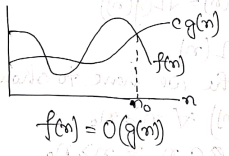
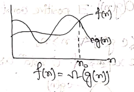
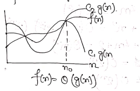

### What is an Algorithm?

An algorithm is a finite set of instructions that if followed, accomplishes a particular task. All algorithm must satisfy the following criteria:

-   Input
-   Output
-   Definiteness
-   Definiteness
-   Effectiveness  

### Algorithm to find and return the maximum of n given numbers.

    MAXIMUM

    Step1: Set Max = 0

    Step2: while (i != n)
             if(i > MAX)
               Set Max = A[i];
             else
               return;

    Step3: Print(Max)

    Step4: Exit

### Analysis of Algorithm

A complete analysis of an algorithm involves the following steps:  

1.  Implement the algorithm correctly.
2.  Determine the time required for each basic operations.
3.  Identify unknown quantities that can be used to describe the frequency of execution of basic operation.
4.  Develop a realistic model for the input to the program.
5.  Analyze the unknown quantities assuming the model input.
6.  Calculate the total running time by multiplying the time by the frequency for each operation and then adding all the products.

### Why analysis of algorithm is important.

1.  To predict the behavior of algorithm without implementing it on a specific machine.
2.  It is impossible to predict the exact behavior of an algorithm as their are too many influencing factors. The analysis is thus only an approximation, not perfect.
3.  By analyzing different algorithm, we can compare them to determine the best one for our purpose.

### Asymptotic Analysis

It is a technique of representing limited behavior. It can be used to analyze the performance of an algorithm for some large dataset.  
  
In the above function, the term  becomes insignificant compared to  when  is very large.  

### Why is Asymptotic Notation important?

1.  They give simple characteristics of an algorithm's efficiency.  
2.  It allows the comparison of the performance of various algorithm.

### Asymptotic Notation
Asymptotic notation are used to describe the running time of an algorithm.  
There are 3 notations used for describing the running time of the algorithm.
1. Big-oh Notation(O-notation): When we have an asymptotic upper-bound, we use O-notation. The O-notation is used when the function f(n) is defined as:  
  
Such that  

Graphically, we represent O notation as follows:  
  

2. Omega Notation (Ω-notation): The Ω notation is used when the function g(n) defines a lower-bound for the function f(n) which is defined as  
  
Such that  

Graphically we can represent  Ω-notation as  
  

3. Theta Notation (Θ-notation): The Θ-notation is used when the function f(n) is bounded both above and below by the function g(n), which is defined as  
  
Such that  

Graphically we can represent  Ω-notation as  
  
