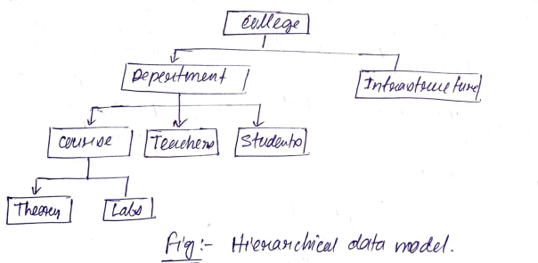
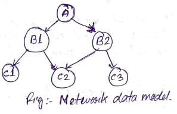
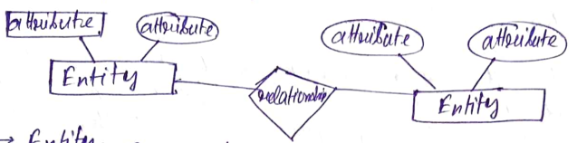
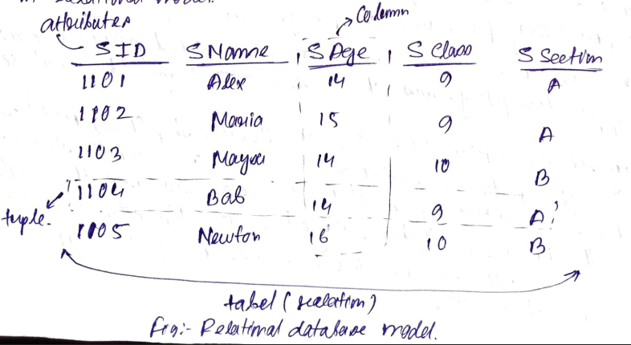
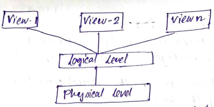

# Importants for Exam

### Entity Integrity
- For Entity Integrity Rules, each table has a primary key
- Primary Key cannot have NULL value  
```
<student>
```  

Student_ID | Student_Awards | Student_Awards |
---------- | -------------- | -------------- |


Above you can see our primary key ie Student_D, we cannot consider Student_Awards as the primary key since not every student would have recieved the award. 


### Referential Integrity
Referential Integrity Rule in DBMS is based on Primary and Foreign key. The rule defines that a foreign key has a matching primary key reference from a table to another table should be valid.
```
<Employee>
```
EMP_ID | EMP_NAME | DEPT_ID |
------ | -------- | ------- |


```
<Department>
```
DEPT_ID | DEPT_NAME | DEPT_ZONE |
------- | --------- | --------- |

The rule states that DEPT_ID in the Employee table has a matching valid DEPT_ID in the Department table.


### DBMS
DBMS is a collection of programs through which a user can create adn maintain a database. The DBMS is hence a general purpose software system that facilitates the process of defining, constructing and manipulating a databse from various applications.  
Defining a data base involves specifying the datatype structures for the data to be stored in a database.  
Contructing the database is the process of storing the data itself or some storage medium ie controlled by the DBMS.  

### DBA

### Data Models
A database model defines the logical design and structure of a database and defines how data will be stored accessed and updated in a database management system. While the relational model is the most widely used database model, there are other models too:


#### Hierarchical Model
- Organises data into a tree like structure with a single root
- starts from the root data and expands like a tree, adding child nodes to the parent nodes
- a child node only has one parent
- organised in a tree like structure with an one-to-many relationships

for example one department can have many courses, many professors and of-course many students.


##### Advantages
- Conceptual simplicity
- Database security and integrity
- Data independence
- Efficiency

##### Disadvantages
- Complex implementation
- Difficult to manage and lack of standards
- Lacks structural independence.
- Applications programming and use complexity
- Implementation limitations


#### Network Model
- Extension of Hierarchical model
- Organised like a graph
- and is allwed to have more than one parent node
- it is more related as more relationships are established
- since data is more related, accessing a data is much easier and fast
- use to map many-to-many data relationships
- was the most widely usd DB model before Relational Model was introduced


##### Advantages
- Represents complex data rel. better than hierarchical model
- Improved DB performance
- Improve a DB "industry" standard
  - Conference on Data System Language(CODASYL)
  - Database Task Group(DBTG)

##### Disadvantages
- Too cumbersome
- lack of "Ad-Hoc" query capability
  - Put heavy preasure on programmers
- Any structural change in the DB could produce havoc in all application programs that drew data from the database.


#### Entity Relationship Model
- Based on the notation of real-world entities and relationships among them
- while formulating real-world scenarios into the database model, the ER model creates entity set, relation set, general attributes and constrains.  

##### ER model is based on
- Entities and their attributes
- Relationships among entities

These concepts are explained below:


##### Entity
- a real world entiry
- having properties called attributes
- attributes are defined by its set of values called domain
***Example: In a school DB a student is considered as an entity. Student have various attributes like names, age, class, etc.***

##### Relationship
- logical association among entities
- these are mapped with entities in various ways.


#### Relational Model
- data is organised into 2D tables and
- the relationship is maintained by storing a common field.
- this model was introduced by EF Codd in 1970
- basick structure of data is in table form
- info. related to a perticular type is stored in the rows of that table
- This is why tables can also be refered as relation in relational model.



The main features of this model are:
1. Data is stored in tables called relations
2. Relations can be normalized
3. In normalized relations, values saved are atomic values
4. Each row in a relation contains a unique value
5. Each column in a relation contains values from same domain.

##### Advantages
- Structure independent
- Improved conceptual simplicity
- Easier DB design, implementation, management and use
- Ad hoc query capabilities (SQL)
- Powerful DBMS

##### Disadvantages
- Substantial hardware and system software overhead
- Possibility of poor desing and implementation
- Potential 'island of information' problems.


### Data Abstruction
Database systems are made-up of complex data structures. To ease the user interection with database the developers hide internal details from users This process of hidding irrelevent details from users is called data abstruction.  
  
- **Physical Level**: This is the lowest level of data abstruction. It describes how data is actually stored in databse. You can get the complex data structure details at this level.
- **Logical Level**: This is the middle level of 3-level data abstraction architecture. It describes what data is stored in database.
- **View Level**: Highest level of data abstraction. This level descibes the user interection with database system.

### Application of Data Base Management System
- Banking system
- Insurance System
- e-commers
- Booking system
- Online Admission -> University Registration -> Online Examination Form Fillup -> Admit Generation -> Marksheet Generation -> Certificate Generation.
- Telecommunication
- Online Trading Stocks and bonds
